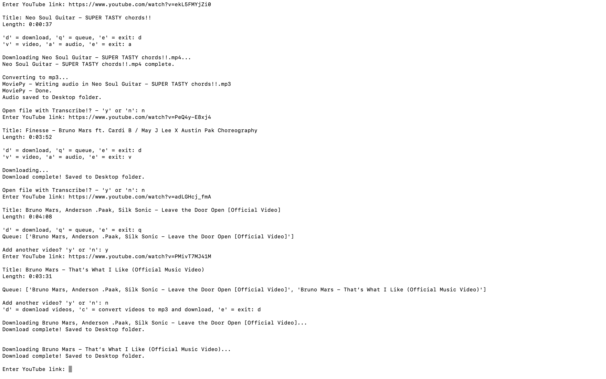

# YouTube Downloader



## Description
This project uses Python to create a script where users can download YouTube videos/audios. 

- Users can copy/paste a YouTube link and the script will prompt the user to download or place the video inside a queue.

- Download video or audio formats.

- If placed inside a queue, users can add more videos to the list and download them alltogether. 

- There is a subsidiary option to open the file with the Transcribe! app (must purchase separately) for musicians.

The purpose for this project was so that I could practice using 3rd-party modules as well as basic programming concepts, particularly while loops. It remains useful for personal music transcription practice.

## Requirements
This project utilizes the [pytube](https://python-pytube.readthedocs.io/en/latest/user/install.html) module.

```
$ pip install pytube
```

It also utilizes the [moviepy](https://pypi.org/project/moviepy/) module.

```
$ pip install moviepy
```

## Usage
To start, copy/paste a YouTube link to the script, like below:

```
Enter YouTube link: https://www.youtube.com/watch?v=XqZsoesa55w
```

## Notes
- Add custom download paths inside any .download() methods. Otherwise, the default path will be the current directory.

- Uncomment the 'Open mp3 with Transcribe!' blocks if you intend to use this feature. Inside the block, make sure to adjust the executable path saved in the 'path_to_Transcribe' variables.

- Follow similar path changes on other commented-out blocks if interested.

- If a certificate error displays while running the script, navigate to your Python folder and run the Install Certificates.command file.